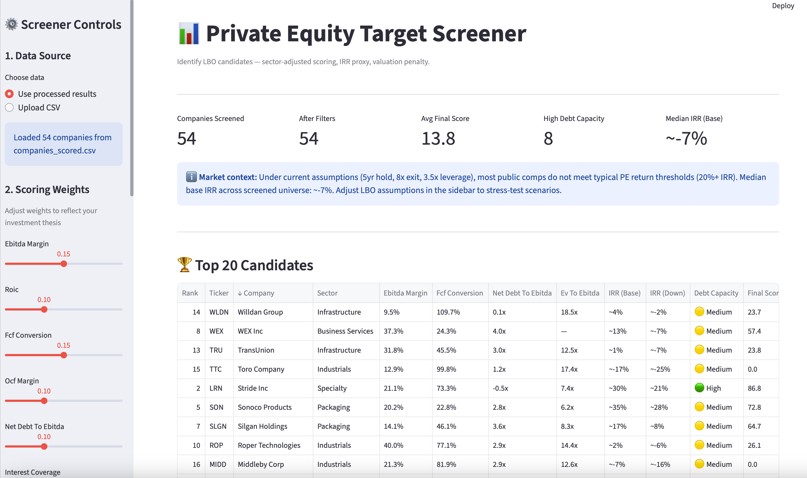

# Private Equity Target Screener

A Python-based private equity screening and deal evaluation engine that identifies potential LBO/buyout candidates from a universe of public companies.
Built to reflect the analytical logic of a private equity analyst: not just financial ratios, but structured judgment about leverage capacity, cash quality, and entry valuation.

---

## Screenshots



---

> **This is not a traditional stock screener.**
>
> It embeds simplified LBO logic to estimate whether a company can realistically generate private equity returns under leverage and operational assumptions. Companies are ranked not just on business quality, but on expected investor returns.

---

## Why this matters

Most screeners rank "good companies."

Private equity cares about something different:
- **Entry price:** a great business at the wrong price destroys returns
- **Leverage capacity:** how much debt can the business support?
- **Cash generation:** is there enough FCF to service debt and create equity value?
- **Exit potential:** what's the realistic return to the investor?

A high-quality company can still be a bad investment if acquired at the wrong price. This tool explicitly captures that difference.

---

## LBO Return Logic

Beyond screening, the model estimates an implied IRR for each company under simplified LBO assumptions:

| Input | Default | Description |
|---|---|---|
| Entry valuation | Actual EV/EBITDA | Current market price |
| Target leverage | 3.5x EBITDA | Debt raised at entry |
| Debt interest rate | 7% | Annual cost of LBO debt |
| EBITDA growth | Actual YoY | Organic growth trajectory |
| FCF → debt repayment | 40% annually | Cash sweep after interest |
| Exit multiple | 8x EV/EBITDA (cap) | Conservative, never above entry |
| Holding period | 5 years | Standard PE hold |

**Three scenarios are computed per company:**
- **Downside:** growth −3%, exit multiple −1x, FCF stressed at 80%
- **Base:** as-is assumptions
- **Upside:** growth +2%, exit multiple +0.5x

The IRR is decomposed into its 3 drivers: EBITDA growth contribution, debt paydown (deleveraging), and multiple expansion/contraction.

---

## Features

- **Real financial data** fetched via `yfinance` (public companies, no API key needed)
- **8 core PE metrics** computed from raw financials
- **Weighted scoring engine:** configurable via `config.yaml`, no code change needed
- **Debt capacity classification:** High / Medium / Low based on PE-style rules
- **Red flag detection:** automated warning signals per company
- **Investment memo snippet:** auto-generated summary for top candidates
- **CSV + Excel export:** ready for further analysis
- **Interactive Streamlit dashboard:** filters, sliders, drill-down, downloadable output

---

## Metrics

| Metric | Formula | PE Rationale | LBO Impact |
|---|---|---|---|
| EBITDA Margin | EBITDA / Revenue | Core profitability proxy | Higher margin means more cash to service debt |
| ROIC | NOPAT / Invested Capital | Capital efficiency | Strong ROIC signals defensible business |
| FCF Conversion | FCF / EBITDA | Cash quality | Direct driver of debt paydown and equity creation |
| FCF Yield on EV | FCF / EV | Real cash return vs price | Complements EV/EBITDA with actual cash view |
| Net Debt / EBITDA | (Debt minus Cash) / EBITDA | Leverage headroom | Lower = more room to add LBO debt |
| Interest Coverage | EBIT / Interest Expense | Debt service capacity | Floor for lender approval |
| EV / EBITDA | EV / EBITDA | Entry valuation | Biggest single driver of IRR math |
| Revenue Growth | YoY % | Growth trajectory | Drives exit EBITDA and deleveraging speed |
| OCF Margin | Operating CF / Revenue | Cash profitability | Secondary FCF quality check |

---

## Repository structure

```
pe-target-screener/
├── README.md
├── claude.md               # Project journal + Claude Code instructions
├── requirements.txt
├── config.yaml             # All weights, thresholds, assumptions
├── main.py                 # Orchestrator, runs the full pipeline
├── data/
│   ├── raw/                # Raw data fetched from yfinance
│   ├── processed/          # Scored and enriched dataset
│   └── sample/             # Universe ticker list
├── screener/
│   ├── loader.py           # Data fetching and validation
│   ├── cleaner.py          # Type casting, NaN handling, outliers
│   ├── ratios.py           # All financial ratio calculations
│   ├── scoring.py          # Percentile-based weighted scoring
│   ├── classifier.py       # Debt capacity + red flag logic
│   ├── ranking.py          # Final ranking and top-N selection
│   ├── exporter.py         # CSV and Excel output
│   └── summary.py          # Auto-generated investment memo snippets
├── app/
│   └── streamlit_app.py    # Interactive dashboard
├── notebooks/
│   └── exploratory_analysis.ipynb
├── tests/
│   ├── test_ratios.py
│   ├── test_scoring.py
│   └── test_cleaner.py
└── outputs/
    ├── top_targets.csv
    └── screening_summary.xlsx
```

---

## How to run

```bash
# Install dependencies
pip install -r requirements.txt

# Run the screening pipeline
python main.py

# Launch the dashboard
streamlit run app/streamlit_app.py
```

---

## Example output

| Rank | Company | Sector | EBITDA Margin | FCF Conv. | Net Debt/EBITDA | Interest Cov. | PE Score | Debt Capacity |
|---|---|---|---|---|---|---|---|---|
| 1 | Firm A | Industrials | 28.1% | 81% | 1.2x | 9.5x | 91.4 | High |
| 2 | Firm B | Healthcare | 24.7% | 76% | 0.8x | 12.0x | 88.9 | High |
| 3 | Firm C | Business Svcs | 21.3% | 68% | 2.1x | 6.2x | 84.1 | Medium |

---

## Configuration

All scoring weights and thresholds are defined in `config.yaml`:

```yaml
weights:
  ebitda_margin: 0.15
  roic: 0.10
  fcf_conversion: 0.15
  ...

thresholds:
  debt_capacity_high_coverage: 5.0
  debt_capacity_high_leverage: 2.5
  ...
```

No code change needed to adjust the model.

---

## Limitations

- **Simplified LBO structure:** no debt tranches, PIK, or revolving credit facility
- **IRR cap at 40%:** companies hitting this cap (e.g. very cheap entry + high FCF) show identical scenario spreads; treat as "exceptionally attractive" rather than a precise number
- **Exit multiple assumptions:** model caps exit at entry multiple (conservative); real deals may achieve expansion or contraction depending on market cycles
- **Financial data quality:** depends on yfinance; some tickers return incomplete data and are excluded
- **Public comps only:** private company dynamics (EBITDA add-backs, management fees, synergies) are not modelled

The model is designed as a deal sourcing and prioritisation tool, not a full investment model.

---

## Next steps

- [ ] Full cash flow waterfall with debt tranches (senior, mezzanine)
- [ ] Interest rate sensitivity analysis
- [ ] Dynamic Monte Carlo simulation for return dispersion
- [ ] Sector-specific scoring profiles (e.g. different leverage norms for Industrials vs Tech)
- [ ] DCF floor valuation overlay
- [ ] Management fee and transaction cost modelling
- [ ] Comparable transactions database for exit multiple benchmarking

---

## Stack

- Python 3.10+
- pandas, numpy
- yfinance
- pyyaml
- openpyxl
- streamlit
- matplotlib / plotly
- pytest
